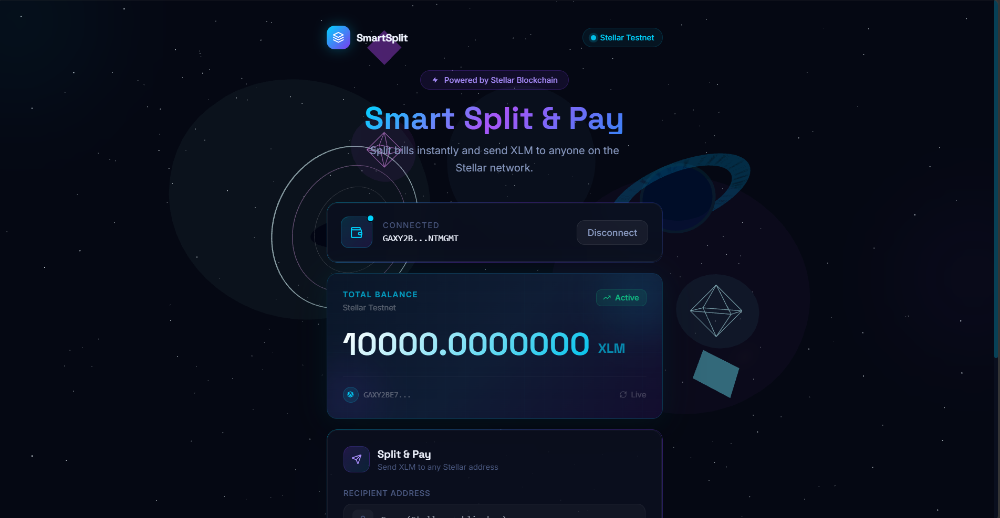
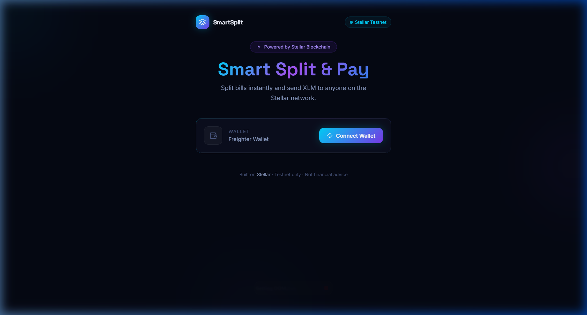
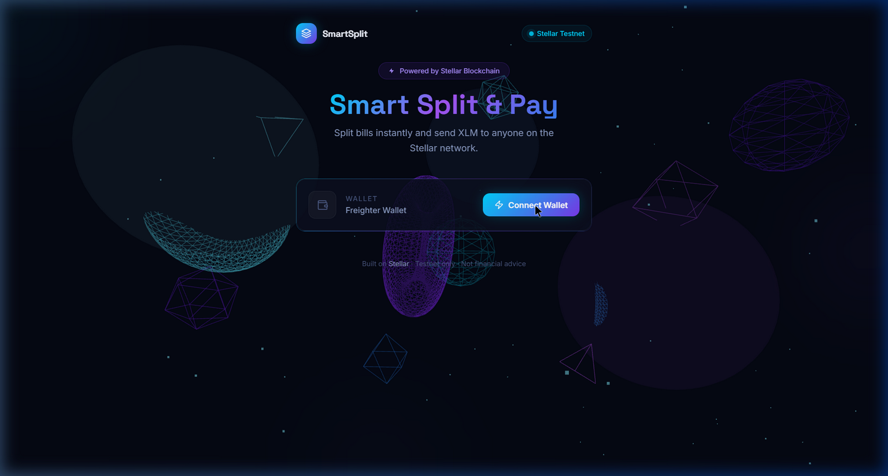

# 🚀 Smart Split & Pay — Stellar dApp

<div align="center">


**A Web3 bill-splitting dApp built on the Stellar Testnet**  
Split bills instantly. Send XLM to friends. Live on-chain.

[](https://stellar.org)
[](https://react.dev)
[](https://threejs.org)
[](LICENSE)

</div>

---

## 🏅 White Belt Certification

> This project was submitted as part of the **Stellar White Belt program** — a foundational Web3 developer curriculum built on the Stellar network.

<div align="center">



</div>

---

## ✨ Features

| Feature | Description |
|---|---|
| 🔗 **Wallet Connect** | One-click Freighter wallet integration with live connection status |
| 💰 **Live Balance** | Real-time XLM balance fetched from Stellar Horizon API |
| ✈️ **Split & Pay** | Send XLM directly to any Stellar address with a single transaction |
| 📡 **Transaction Feedback** | Live success/error status with clickable transaction hash to Stellar Explorer |
| 🛸 **Freighter Guard** | Automatic detection if Freighter is missing — shows install guide toast |
| 🌌 **3D Space UI** | Interstellar-themed Three.js background with star field, wormhole ring, and ringed planet |

---

## 🏗️ System Architecture

```
┌─────────────────────────────────────────────────────────────┐
│                        USER BROWSER                         │
│                                                             │
│  ┌─────────────────────────────────────────────────────┐   │
│  │              React Frontend (Vite)                  │   │
│  │                                                     │   │
│  │  ┌──────────────┐  ┌──────────────────────────┐    │   │
│  │  │  Background  │  │      App.jsx (Root)       │    │   │
│  │  │  3D (R3F +   │  │                          │    │   │
│  │  │  Three.js)   │  │  ┌────────────────────┐  │    │   │
│  │  └──────────────┘  │  │  WalletConnect.jsx  │  │    │   │
│  │                    │  └────────────────────┘  │    │   │
│  │  ┌──────────────┐  │  ┌────────────────────┐  │    │   │
│  │  │  Freighter   │  │  │  BalanceCard.jsx    │  │    │   │
│  │  │  Notice Toast│  │  └────────────────────┘  │    │   │
│  │  └──────────────┘  │  ┌────────────────────┐  │    │   │
│  │                    │  │ SplitPaymentForm.jsx│  │    │   │
│  │                    │  └────────────────────┘  │    │   │
│  │                    │  ┌────────────────────┐  │    │   │
│  │                    │  │TransactionStatus.jsx│  │    │   │
│  │                    │  └────────────────────┘  │    │   │
│  │                    └──────────────────────────┘    │   │
│  └─────────────────────────────────────────────────────┘   │
│                              │                              │
└──────────────────────────────┼──────────────────────────────┘
                               │
              ┌────────────────┴────────────────┐
              │                                 │
   ┌──────────▼──────────┐         ┌────────────▼──────────┐
   │  Freighter Extension │         │  Stellar Horizon API  │
   │  (Browser Wallet)    │         │  horizon-testnet      │
   │                      │         │  .stellar.org         │
   │  • getAddress()      │         │                       │
   │  • signTransaction() │         │  • loadAccount()      │
   │  • isConnected()     │         │  • submitTransaction()│
   └──────────┬──────────┘         └────────────┬──────────┘
              │                                 │
              └────────────────┬────────────────┘
                               │
                    ┌──────────▼──────────┐
                    │  Stellar Testnet    │
                    │   Blockchain        │
                    │                    │
                    │  Network: TESTNET  │
                    │  Asset: XLM native │
                    │  Timeout: 30s      │
                    └────────────────────┘
```

---

## 🔄 Data Flow — Sending a Payment

```
User fills form
      │
      ▼
SplitPaymentForm.jsx
  onSend(recipient, amount)
      │
      ▼
App.jsx → handleSendPayment()
      │
      ▼
stellar.js → sendPayment()
      │
      ├─► server.loadAccount(senderPublicKey)
      │         └─► Horizon API ──► account + sequence number
      │
      ├─► TransactionBuilder
      │       .addOperation(Payment)
      │       .setTimeout(30)
      │       .build()
      │
      ├─► transaction.toXDR()
      │
      ├─► Freighter: signTransaction(xdr, { network: 'TESTNET' })
      │       └─► User approves in extension popup
      │
      ├─► TransactionBuilder.fromXDR(signedXdr)
      │
      └─► server.submitTransaction(signedTx)
              └─► Stellar Testnet Ledger
                      │
                      ▼
              TransactionStatus.jsx
              ✅ Success: hash + Explorer link
              ❌ Error: message displayed
```

---

## 🛠️ Tech Stack

| Layer | Technology |
|---|---|
| **Frontend Framework** | React 18 + Vite |
| **Styling** | Tailwind CSS v3 + Vanilla CSS custom properties |
| **3D Graphics** | Three.js + React Three Fiber (`@react-three/fiber`) |
| **Wallet** | Freighter Browser Extension + `@stellar/freighter-api` |
| **Blockchain SDK** | `@stellar/stellar-sdk` (Horizon client + TransactionBuilder) |
| **Network** | Stellar Testnet via `https://horizon-testnet.stellar.org` |
| **Typography** | Inter + Space Grotesk (Google Fonts) |
| **Icons** | Lucide React |

---

## 📁 Project Structure

```
smart-split-pay-dapp/
├── public/                     # Static assets
├── screenshots/                # App screenshots & certificate
│   ├── white-belt-certificate.png
│   ├── 01-wallet-disconnected.png
│   ├── 02-3d-wireframe-theme.png
│   ├── 03-interstellar-theme.png
│   └── 04-wallet-connected-balance.png
├── src/
│   ├── components/
│   │   ├── Background3D.jsx    # Three.js interstellar 3D scene
│   │   ├── FreighterNotice.jsx # Extension missing toast popup
│   │   ├── WalletConnect.jsx   # Freighter connect/disconnect UI
│   │   ├── BalanceCard.jsx     # Live XLM balance display
│   │   ├── SplitPaymentForm.jsx# Send payment form
│   │   └── TransactionStatus.jsx # Tx success/error feedback
│   ├── services/
│   │   └── stellar.js          # Horizon API + Freighter logic
│   ├── App.jsx                 # Root component + state management
│   ├── App.css                 # App-level overrides
│   ├── index.css               # Global design system + animations
│   └── main.jsx                # React entry point
├── index.html                  # HTML entry (Google Fonts, meta)
├── tailwind.config.js
├── vite.config.js
└── package.json
```

---

## 📸 UI Progression — White Belt Journey

### 1. Clean Disconnected State
> First launch — wallet not yet connected, hero layout with cyan–violet gradient title.



---

### 2. 3D Wireframe Theme (v1)
> First iteration of the 3D background — colorful geometric wireframe objects (tori, icosahedrons, octahedra).



---

### 3. Interstellar Space Theme (v2 — Final)
> Refined to a cinematic Interstellar-style scene: 1,800-star field, wormhole gravitational ring, ringed planet, nebula clouds, and data crystals. Fewer objects, more majestic.


---

### 4. Wallet Connected — Live Balance
> Freighter connected, showing live testnet XLM balance (`10,000 XLM`) fetched from Stellar Horizon API, with the Split & Pay form rendered below.


---

## 🚀 Getting Started

### Prerequisites

- **Node.js** v18+
- **[Freighter Wallet Extension](https://www.freighter.app/)** — Chrome or Firefox
 - After installing, go to Settings → Network → switch to **Testnet**
 - Fund your testnet account via [Stellar Friendbot](https://laboratory.stellar.org/#account-creator?network=test)

### Installation

```bash
# Clone the repository
git clone https://github.com/pratickdutta/Smart-Split-Pay-dApp.git
cd Smart-Split-Pay-dApp

# Install dependencies
npm install

# Start the development server
npm run dev
```

Open [http://localhost:5173](http://localhost:5173) in your browser.

### Usage

1. Click **Connect Wallet** — Freighter will ask for permission
2. Your wallet address and live XLM balance appear
3. Enter a **recipient Stellar address** (`G...`)
4. Enter the **amount in XLM**
5. Click **Send & Pay** — approve the transaction in Freighter
6. See the **transaction hash** with a direct link to [Stellar Expert Explorer](https://stellar.expert/explorer/testnet)

> ⚠️ **Testnet only.** No real value is transferred. Always verify you are on the Testnet network in Freighter settings.

---

## 🎨 Design System

The UI uses a custom Web3 dark theme with CSS custom properties:

| Token | Value | Usage |
|---|---|---|
| `--bg-primary` | `#050813` | Page background |
| `--bg-card` | `#0d1425` | Card surfaces |
| `--accent-cyan` | `#00d4ff` | Primary accent, glows |
| `--accent-violet` | `#7c3aed` | Secondary accent |
| `--text-primary` | `#f0f4ff` | Headings |
| `--text-secondary` | `#8b9cc4` | Body text |
| `--border-subtle` | `rgba(255,255,255,0.06)` | Card borders |

Key UI techniques: **glassmorphism** (`backdrop-filter: blur`), **gradient borders** via pseudo-element masking, **CSS keyframe animations** (`slideUp`, `scaleIn`, `pulse-cyan`), and **Three.js WebGL** for the 3D scene.

---

## 🔮 Future Scope (Level 2+)

- [ ] **Group vaults** — Shared on-chain pools via Soroban smart contracts
- [ ] **Bill splitting math** — Input a total and split equally among N friends
- [ ] **Transaction history** — View past splits stored on-chain
- [ ] **QR code sharing** — Share wallet address for quick pay
- [ ] **Multi-asset support** — USDC and other Stellar tokens
- [ ] **Mainnet deployment** — Production mode with real XLM

---

## 🤝 Acknowledgements

- [Stellar Development Foundation](https://stellar.org) — Blockchain infrastructure
- [Freighter](https://www.freighter.app/) — Browser wallet
- [Stellar Laboratory](https://laboratory.stellar.org) — Testnet tools
- [React Three Fiber](https://docs.pmnd.rs/react-three-fiber) — 3D rendering
- [Lucide React](https://lucide.dev) — Icon library

---

<div align="center">

Built with ❤️ on the Stellar Testnet · White Belt Submission

</div>
