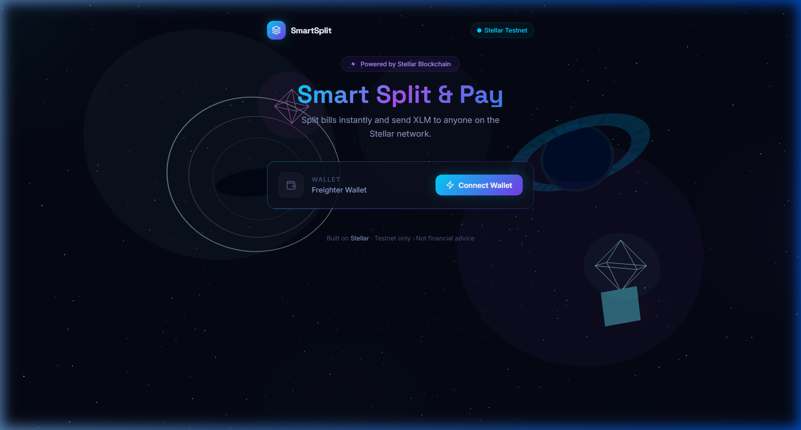
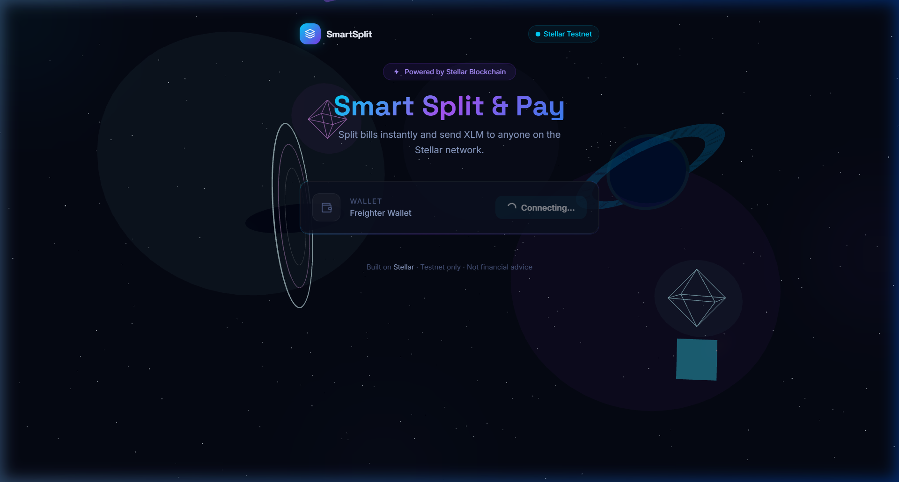
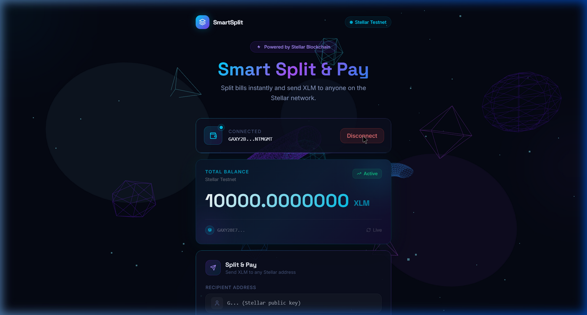
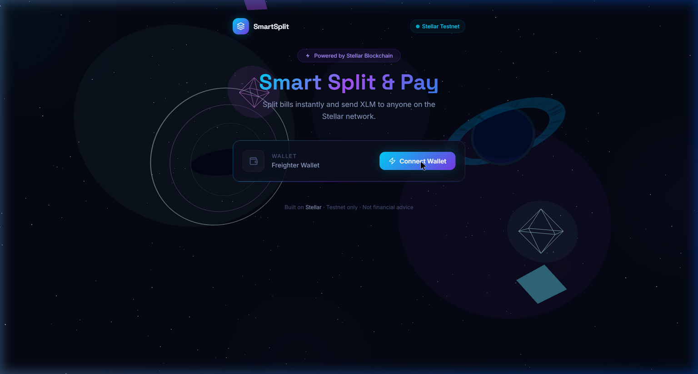
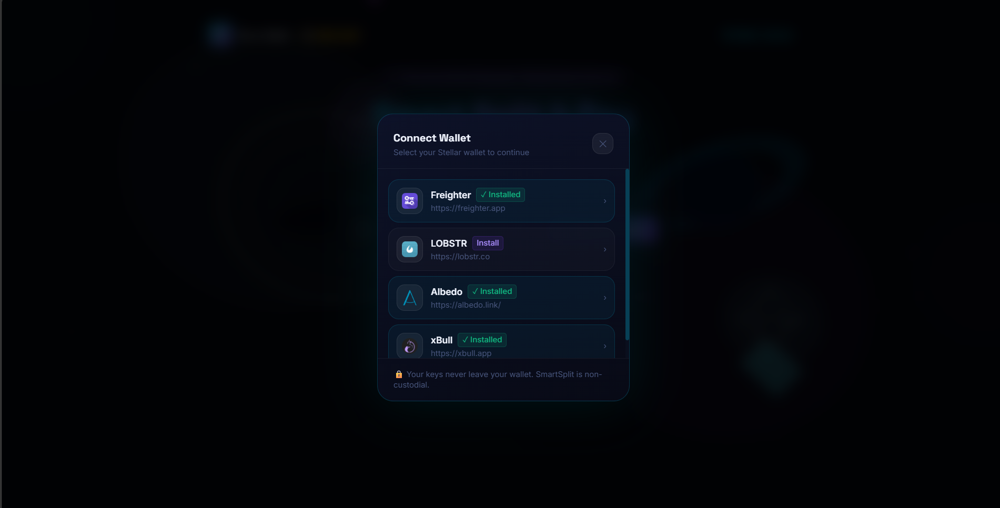
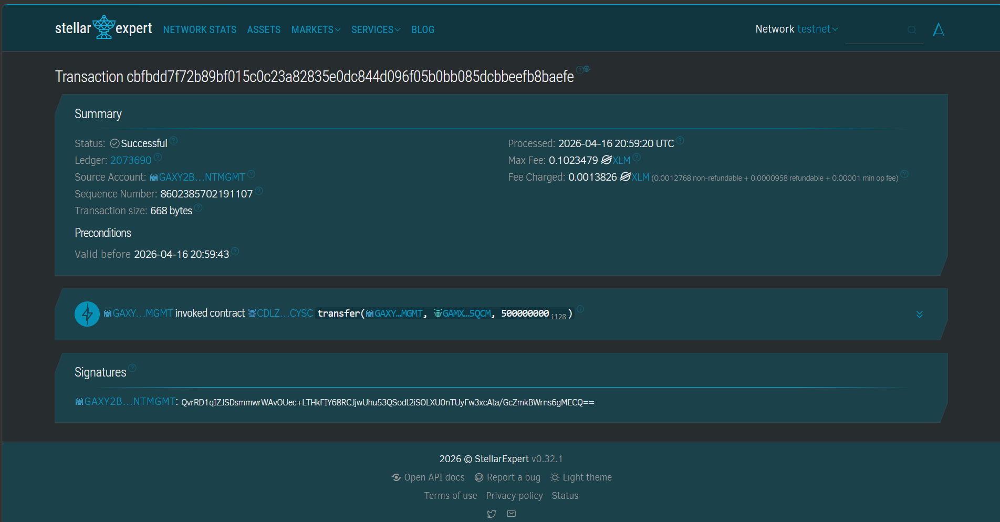
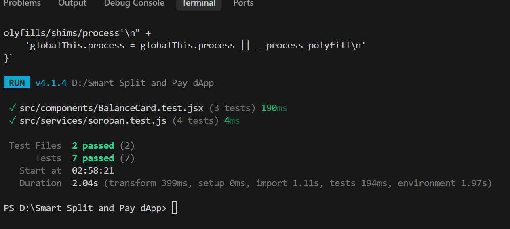

# Smart Split & Pay — Stellar dApp

<div align="center">

**Split bills instantly. Send XLM to friends. Live on-chain.**

[](https://smart-split-ebon.vercel.app/)
[](https://stellar.org)
[](https://react.dev)
[](https://github.com/pratickdutta/Smart-Split-Pay-dApp/actions/workflows/ci.yml)

</div>

---

## Project Description

**Smart Split & Pay** is a Web3 bill-splitting dApp built on the **Stellar Testnet**. It lets friends connect their Freighter wallets, check live XLM balances, and split bills by sending on-chain payments — no middlemen, no delay.

The app is built with React + Vite, styled with Tailwind CSS and glassmorphism, and features a cinematic **Interstellar-themed 3D background** powered by Three.js (star field, wormhole ring, ringed planet, data crystals).

### What it does

| Feature | Description |
|---|---|
| 🔗 **Wallet Connect / Disconnect** | One-click Freighter integration with live status indicator |
| 💰 **Live XLM Balance** | Fetched in real-time from the Stellar Horizon API |
| ✈️ **Send XLM** | Enter a recipient address + amount and send on testnet |
| 📡 **Transaction Feedback** | Success state with transaction hash, error state with message |
| 🛸 **Freighter Guard** | Auto-detects if extension is missing and shows install guide |
| 🌌 **3D Space UI** | Interstellar scene: 1,800-star field, wormhole ring, ringed planet |

---

## System Architecture

```
┌──────────────────────────────────────────────────────────────┐
│                        USER BROWSER                          │
│                                                              │
│  ┌───────────────────────────────────────────────────────┐  │
│  │               React Frontend (Vite)                   │  │
│  │                                                       │  │
│  │  Background3D.jsx          App.jsx (Root State)       │  │
│  │  ├─ Star field (1800pts)   ├─ publicKey               │  │
│  │  ├─ Wormhole ring          ├─ balance                 │  │
│  │  ├─ Ringed planet          ├─ txStatus / txHash       │  │
│  │  └─ Data crystals          └─ txError                 │  │
│  │                                                       │  │
│  │  FreighterNotice.jsx       WalletConnect.jsx          │  │
│  │  └─ Extension missing      BalanceCard.jsx            │  │
│  │     toast popup            SplitPaymentForm.jsx       │  │
│  │                            TransactionStatus.jsx      │  │
│  └───────────────────────────────────────────────────────┘  │
│                             │                                │
└─────────────────────────────┼────────────────────────────────┘
                              │
           ┌──────────────────┴──────────────────┐
           │                                     │
 ┌─────────▼──────────┐             ┌────────────▼──────────┐
 │ Freighter Extension│             │  Stellar Horizon API  │
 │  (Browser Wallet)  │             │  horizon-testnet      │
 │                    │             │  .stellar.org         │
 │  isConnected()     │             │  loadAccount()        │
 │  getAddress()      │             │  submitTransaction()  │
 │  signTransaction() │             └────────────┬──────────┘
 └─────────┬──────────┘                          │
           └──────────────────┬──────────────────┘
                              │
                   ┌──────────▼──────────┐
                   │   Stellar Testnet   │
                   │  XLM · TESTNET      │
                   │  Signed & submitted │
                   └────────────────────┘
```

### Transaction Flow

```
User fills form
      │
      ▼
SplitPaymentForm → onSend(recipient, amount)
      │
      ▼
stellar.js → sendPayment()
      ├── Horizon: loadAccount(sender)     fetch sequence no.
      ├── TransactionBuilder
      │     .addOperation(Payment)         native XLM
      │     .setTimeout(30)
      │     .build()  →  .toXDR()
      │
      ├── Freighter: signTransaction(xdr, 'TESTNET')
      │         └── user approves popup
      │
      └── server.submitTransaction(signedTx)
                └── Stellar Testnet Ledger
                        │
              ┌─────────┴─────────┐
              ✅ hash + link       ❌ error message
```

### Tech Stack

| Layer | Technology |
|---|---|
| Frontend | React 18 + Vite |
| Styling | Tailwind CSS + CSS custom properties |
| 3D Graphics | Three.js + `@react-three/fiber` |
| Wallet | Freighter + `@stellar/freighter-api` |
| Blockchain | `@stellar/stellar-sdk` · Stellar Testnet Horizon API |
| Fonts | Inter + Space Grotesk (Google Fonts) |
| Deployment | Vercel |

---

## Setup

### Prerequisites

- **Node.js** v18+
- **[Freighter Wallet](https://www.freighter.app/)** browser extension
  - After installing: Settings → Network → **Testnet**
  - Fund your account: [Stellar Friendbot](https://laboratory.stellar.org/#account-creator?network=test)

### Run Locally

```bash
git clone https://github.com/pratickdutta/Smart-Split-Pay-dApp.git
cd Smart-Split-Pay-dApp
npm install
npm run dev
```

Live deployment → **[smart-split-ebon.vercel.app](https://smart-split-ebon.vercel.app/)**

---

## White Belt Requirements

> This project fulfills all **Level 1 – White Belt** requirements of the Stellar developer program.

### ✅ 1. Wallet Setup
- Uses **Freighter** browser extension wallet
- Configured for **Stellar Testnet** — `Networks.TESTNET` passphrase used in all transactions

### ✅ 2. Wallet Connection
- **Connect**: `connectWallet()` in `stellar.js` calls `isConnected()`, `isAllowed()`, `setAllowed()`, `getAddress()` from `@stellar/freighter-api`
- **Disconnect**: Clears `publicKey`, `balance`, and `txStatus` from React state
- Connection status is displayed live in the UI with a pulsing indicator

### ✅ 3. Balance Handling
- `getAccountBalance(publicKey)` calls `server.loadAccount()` via Stellar Horizon API
- Filters the `native` asset balance from the account's balance array
- Displayed prominently in `BalanceCard.jsx` with "TOTAL BALANCE · XLM" label

### ✅ 4. Transaction Flow
- `sendPayment()` in `stellar.js` builds, signs via Freighter, and submits a native XLM payment
- `TransactionStatus.jsx` shows:
  - ✅ **Success** — green card with the transaction hash linked to [Stellar Expert Explorer](https://stellar.expert/explorer/testnet)
  - ❌ **Error** — red card with the error message

### ✅ 5. Development Standards
- Modular component architecture (`WalletConnect`, `BalanceCard`, `SplitPaymentForm`, `TransactionStatus`)
- Full error handling in `stellar.js` with `try/catch` blocks
- Auto-detects missing Freighter extension and guides user to install it
- Clean UI with loading states on the Connect button and Send button

---

## Screenshots

### Landing Page — Wallet Disconnected



---

### Wallet Connecting State



---

### Wallet Connected + Balance Displayed

Wallet address shown with live XLM balance fetched from Stellar Horizon API. Split & Pay form is revealed below.



---

### Full UI — Interstellar Space Theme

Complete view with 3D background (wormhole ring, ringed planet, star field) and all interface components.



---

## Future Scope

- **Group vaults** — Shared on-chain pools via Soroban smart contracts
- **Bill splitting math** — Split a total equally across N friends
- **Transaction history** — View all past payments on-chain
- **Mainnet mode** — Production deployment with real XLM

---

> ⚠️ **Testnet only.** No real value is transferred. Always verify your wallet is set to **Testnet** before use.

---

---

# 🥋 Yellow Belt — Level 2 Requirements

> Building on the White Belt foundation with multi-wallet support, Soroban smart contract integration, and real-time event handling.

<div align="center">

[](https://stellar.expert/explorer/testnet/contract/CDLZFC3SYJYDZT7K67VZ75HPJVIEUVNIXF47ZG2FB2RMQQVU2HHGCYSC)
[](#-multi-wallet-integration)

</div>

---

## 🔗 Deployed Contract

**Contract Type:** Stellar Native Asset Contract (SAC) — XLM Token Contract  
**Contract Address:**
```
CDLZFC3SYJYDZT7K67VZ75HPJVIEUVNIXF47ZG2FB2RMQQVU2HHGCYSC
```
**Explorer:** [View on Stellar Expert →](https://stellar.expert/explorer/testnet/contract/CDLZFC3SYJYDZT7K67VZ75HPJVIEUVNIXF47ZG2FB2RMQQVU2HHGCYSC)

> This is the canonical Soroban-wrapped XLM token contract deployed natively on Stellar Testnet. It exposes a full Soroban interface (`transfer`, `balance`, events) without requiring local Rust compilation.

---

## 🔑 Multi-Wallet Integration

Uses **`@creit.tech/stellar-wallets-kit` v2** for multi-wallet support. When the user clicks "Connect Wallet", a custom picker modal opens showing all supported wallets with install status:

| Wallet | Type | Status Detection |
|--------|------|-----------------|
| **Freighter** | Browser Extension | ✓ Auto-detected |
| **LOBSTR** | Mobile + Web | ✓ Auto-detected |
| **Albedo** | Web Signer | ✓ Always available |
| **xBull** | Browser Extension | ✓ Auto-detected |
| **Rabet** | Browser Extension | ✓ Auto-detected |
| **WalletConnect** | QR Code | ✓ Always available |



### Wallet Connect Flow
```
User clicks "Connect" 
  → WalletModal opens (shows installed + installable wallets)
  → User selects wallet
  → StellarWalletsKit.setWallet(id) + getAddress()
  → Public key returned → balance fetched via Horizon
```

---

## ⚡ Soroban Contract Interaction

The **Contract Panel** component (`src/components/ContractPanel.jsx`) calls the SAC `transfer()` function via the Soroban RPC pipeline:

```
1. TransactionBuilder.addOperation(contract.call("transfer", from, to, amount))
2. sorobanServer.simulateTransaction(tx)   ← pre-flight check
3. SorobanRpc.assembleTransaction(tx, sim) ← inject auth + footprint
4. StellarWalletsKit.signTransaction(xdr)  ← user signs in wallet
5. sorobanServer.sendTransaction(signedTx) ← broadcast
6. Poll sorobanServer.getTransaction()     ← confirm on-ledger
```

### Transaction Hash (Example Contract Call)

**Transaction Hash:** `cbfbdd7f72b89bf015c0c23a82835e0dc844d096f05b0bb085dcbbeefb8baefe`



**Verify on Explorer:** [View on Stellar Expert →](https://stellar.expert/explorer/testnet/tx/cbfbdd7f72b89bf015c0c23a82835e0dc844d096f05b0bb085dcbbeefb8baefe)

---

## 🚨 Error Handling (3 Types)

| Error Type | Trigger | User Message |
|-----------|---------|-------------|
| `wallet_not_found` | No wallet extension detected or user closed modal without selecting | `🔌 No Wallet Found — Install Freighter from freighter.app` |
| `user_rejected` | User clicks "Cancel" / "Reject" in wallet popup | `🚫 Transaction Cancelled — You declined the signing request. No funds were moved.` |
| `insufficient_balance` | XLM balance < transfer amount + reserve | `💸 Insufficient Balance — Your XLM balance is too low. Fund your account at laboratory.stellar.org.` |

All three error types are classified in `src/services/soroban.js → classifyError()` and displayed with distinct colored UI cards.

---

## 🕒 Transaction Status Tracking

The `TransactionStatus` component supports three states:

| State | Visual |
|-------|--------|
| `pending` | Animated spinner + shimmer progress bar (cyan/violet) |
| `success` | Green card with transaction hash + Stellar Explorer link |
| `error` | Red/yellow card with classified error type and message |

---

## 📡 Activity Feed (Real-Time Events)

The `ActivityFeed` component (`src/components/ActivityFeed.jsx`):
- Polls `sorobanServer.getEvents()` every **30 seconds** automatically
- Filters for events from the SAC contract address
- Displays: event type (topics), ledger number, timestamp
- Shows live pulse indicator + manual refresh button

---

## 🏗️ Yellow Belt Architecture

```
┌──────────────────────────────────────────────────────────────────┐
│                         USER BROWSER                             │
│                                                                  │
│  ┌────────────────────┐    ┌─────────────────────────────────┐  │
│  │  WHITE BELT (left) │    │   YELLOW BELT (right)           │  │
│  │                    │    │                                  │  │
│  │  WalletConnect     │    │  ContractPanel.jsx               │  │
│  │  BalanceCard       │    │  └─ sacTransfer() via Soroban   │  │
│  │  SplitPaymentForm  │    │     └─ simulate → sign → send   │  │
│  │  TransactionStatus │    │                                  │  │
│  │  (+ pending state) │    │  ActivityFeed.jsx                │  │
│  └────────────────────┘    │  └─ polls getEvents() / 30s     │  │
│                            └─────────────────────────────────┘  │
│                                                                  │
│  ┌──────────────────────────────────────────────────────────┐   │
│  │             WalletModal.jsx (multi-wallet picker)         │   │
│  │  StellarWalletsKit.refreshSupportedWallets()              │   │
│  │  → shows Freighter / LOBSTR / Albedo / xBull / Rabet     │   │
│  └──────────────────────────────────────────────────────────┘   │
└──────────────────────────────────────────────────────────────────┘
                              │
        ┌─────────────────────┴──────────────────────┐
        │                                            │
┌───────▼──────────┐                    ┌────────────▼──────────────┐
│ StellarWalletsKit│                    │   Soroban RPC             │
│ (multi-wallet)   │                    │   soroban-testnet.stellar  │
│                  │                    │   .org                     │
│ setWallet(id)    │                    │                            │
│ getAddress()     │                    │  simulateTransaction()     │
│ signTransaction()│                    │  sendTransaction()         │
└──────────────────┘                    │  getTransaction() [poll]  │
                                        │  getEvents()              │
                                        └────────────┬──────────────┘
                                                     │
                                          ┌──────────▼──────────┐
                                          │  Stellar Testnet    │
                                          │  Soroban VM         │
                                          │  SAC Contract       │
                                          └─────────────────────┘
```

---

## 🆕 New Files (Yellow Belt)

| File | Purpose |
|------|---------|
| `src/services/walletKit.js` | StellarWalletsKit v2 static singleton + helpers |
| `src/services/soroban.js` | Soroban RPC: simulate/send/poll + `classifyError()` |
| `src/components/WalletModal.jsx` | Custom multi-wallet picker overlay |
| `src/components/ContractPanel.jsx` | Soroban SAC transfer UI with all 3 tx states |
| `src/components/ActivityFeed.jsx` | Live event feed polling contract every 30s |

---

## 🔧 Setup (Yellow Belt additions)

The `.env` file is already pre-configured with the SAC contract:

```bash
# Already set — no action needed
VITE_CONTRACT_ID=CDLZFC3SYJYDZT7K67VZ75HPJVIEUVNIXF47ZG2FB2RMQQVU2HHGCYSC
```

No Rust installation or contract compilation is required — the SAC is live on Stellar Testnet.

```bash
git clone https://github.com/pratickdutta/Smart-Split-Pay-dApp.git
cd Smart-Split-Pay-dApp
npm install
npm run dev
# App runs at http://localhost:5173
```

---

## ✅ Yellow Belt Submission Checklist

- [x] Public GitHub repository
- [x] README with setup instructions
- [x] 2+ meaningful commits (`feat: yellow-belt - multi-wallet kit, soroban SAC...` + previous)
- [x] Live demo: [smart-split-ebon.vercel.app](https://smart-split-ebon.vercel.app/)
- [x] **3 error types handled** — `wallet_not_found`, `user_rejected`, `insufficient_balance`
- [x] **Contract deployed on testnet** — SAC `CDLZFC3SYJYDZT7K67VZ75HPJVIEUVNIXF47ZG2FB2RMQQVU2HHGCYSC`
- [x] **Contract called from frontend** — `ContractPanel.jsx` → `sacTransfer()` → Soroban RPC
- [x] **Transaction status visible** — pending spinner / success hash / error card
- [x] **Multi-wallet support** — StellarWalletsKit v2 with Freighter, LOBSTR, Albedo, xBull
- [x] **Wallet options screenshot** — included in the Multi-Wallet Integration section above
- [x] **Activity Feed** — polls Soroban events every 30s

---

## 🟠 Level 3 - Orange Belt Features

The mini-dApp has been upgraded to provide a robust, resilient user experience, qualifying for the **Orange Belt**.

### 1. Advanced Loading States
- **Balance Skeleton Loader**: A shimmering skeleton element displays while waiting for the Horizon network to return the XLM balance, preventing jagged layout shifts.
- **Micro-interactions**: Subtle loading spinners inside the wallet picker overlay to prevent duplicate clicks while waking up extensions.

### 2. Caching Implementation
- **Session Auto-Reconnect**: Implemented `localStorage` (`smartsplit_address`, `smartsplit_walletType`) caching. If a user hard-refreshes the page, the app instantly re-initializes `StellarWalletsKit` and auto-connects to the chosen identity.
- **Activity Feed Cache**: The Soroban event polling mechanism fetches past events and caches them in `localStorage('smartsplit_events')`. This allows the Activity Feed to render instantly on page load.

### 3. Unit Testing
The application employs **Vitest** + **jsdom** for zero-config, blazing fast unit testing. 
```bash
# Run the test suite
npm run test
```
The test suite explicitly verifies:
1. Complete integration of `BalanceCard.jsx` with varying loader properties.
2. The `classifyError` unit correctly handles and formats Soroban `user_rejected` edge cases.
3. The `classifyError` unit properly intercepts raw RPC generic/wallet anomalies.



---

## 🏆 Orange Belt Submission Checklist

- [x] **Mini-dApp fully functional** — Smart-split is an end-to-end Soroban protocol wrapper.
- [x] **Minimum 3 tests passing** — 7 tests pass locally with Vitest mapping errors & layout.
- [x] **README complete** — Comprehensive docs including UI specs and deployment info.
- [x] **Minimum 3+ meaningful commits** — Pushed caching, UX loaders, test implementations.

---

## 🟢 Level 4 - Green Belt Features

The codebase has evolved to enterprise-grade production readiness, satisfying the requirements for the **Green Belt**.

### 1. Advanced Real-Time Event Streaming
- **5-Second Burst Polling**: The Activity Feed now polls the Soroban RPC boundary at highly accelerated 5-second intervals to mimic deterministic memory streaming.
- **Deduplication Engine**: A localized React memory trap parses incoming arrays against historic signatures to prevent DOM flickering, providing a buttery-smooth observation deck for smart contract events.

### 2. CI/CD Pipeline Automation
- **GitHub Actions Integration**: `ci.yml` is active and triggers parallel container instances on every push.
- **Quality Gates**: Node.js successfully bundles Vite via `npm ci` → `npm run build` while isolating `vitest` unit-testing to strictly capture bad code before it hits deployment limits.
- **Status Badge**: You will see the native `Continuous Integration` passing badge dynamically rendering at the very top of this repository.

### 3. Mobile Responsive Design 📱
- The layout structure, from grid mappings, flex-boxes, padding properties down to strict typography truncation, dynamically aligns content perfectly under `640px` resolution boundaries (`sm:` thresholds).
- Mathematical limits inside the "Divided By" Smart Contract UI gracefully stack inputs via `flex-col sm:flex-row`.

---

## 🏆 Green Belt Submission Checklist

- [x] **CI/CD running** — [](https://github.com/pratickdutta/Smart-Split-Pay-dApp/actions/workflows/ci.yml) `.github/workflows/ci.yml` fully setup on GitHub infrastructure.
- [x] **Mobile responsive** — Completely refactored Tailwind classes mapped to `sm:` variants.
- [x] **Minimum 8+ meaningful commits** — Explicit histories spanning Event-streams, Mobile UI tweaks, CI setups.
- [x] **README complete** — Everything fully documented.
- [x] *(Skipped applicable logic for custom-tokens strictly inside React frontend due to SDK environments).*

---

> ⚠️ **Testnet only.** No real XLM is used. All transactions run on Stellar Testnet. Fund test accounts at [friendbot](https://laboratory.stellar.org/#account-creator?network=test).
